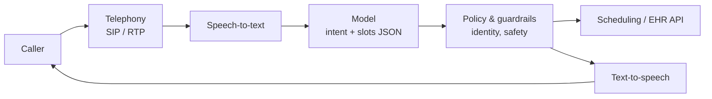

# Voice Agent QA Lab


A QA framework for an **AI voice agent** that answers calls for a medical clinic. It covers debugging bad calls layer by layer, evaluating non-deterministic models, red-teaming guardrails, gating releases and monitoring quality in production.

The agent is a **simulation**. Telephony, speech-to-text, the model, text-to-speech and the scheduling/EHR integration are separate layers with realistic variation and injectable faults, so every QA technique here can run, fail and be reproduced in CI. It uses only the Python standard library, plus pytest for tests. **All patient data is fictional.**



Every call produces a trace: what the caller said vs. what STT heard, the raw model output, latency spans per layer, logs and the outcome.

## What this project covers

| QA area | Implementation | Try it |
| --- | --- | --- |
| **Voice debugging: which layer failed?** | `triage/isolate.py` works bottom-up through telephony → STT → model → integration → TTS using WER, confidence, packet loss, schema checks and latency spans. 10 fault scenarios are each isolated to the correct layer. | `python -m agent.replay --scenario F04 --triage` |
| **Reproducible tickets** | `triage/ticket.py` writes the layer, evidence, owner, transcript, latency trace and a one-line seeded replay command | [example ticket](docs/examples/ticket-F04-packet-loss.md) |
| **Evaluation and regression** | 24-call golden set: intent accuracy, slot exact-match and F1, structured-output validation, and a transcript rubric judge. `evals/compare.py` flags regressions when the model changes (v1 → v2). | [v1 vs v2](docs/examples/compare_v1_vs_v2.md) |
| **Non-deterministic tests** | Multi-seed runs, 95% Wilson intervals, adaptive extra runs, zero tolerance for safety cases, and a quarantine with owner and expiry. No rerun-until-green. | [flake policy](docs/flake-policy.md) |
| **Release criteria** | `release/criteria.json` + `release/gate.py` give a GO or NO-GO decision. Waivers need an approver and an expiry date; privacy and safety gates can't be waived. | [GO](docs/examples/release-decision-v1.md) / [NO-GO](docs/examples/release-decision-v2.md) |
| **Classical QA** | Test plan, bug triage severities, pytest API and unit tests, and a GitHub Actions pipeline | [test plan](docs/test-plan.md) |
| **Quality in production** | Samples 10% of live calls, tracks daily metrics, detects drift (including PSI on the intent mix) and routes alerts to the root-cause owner with replay commands | [production report](docs/examples/production-report.md) |
| **Red-teaming** | 12 attacks: prompt injection through documents, off-script callers, medical-advice pressure, family and clinician impersonation, date-of-birth guessing. The suite also proves it fails against a vulnerable agent. | [red-team plan](docs/red-team-plan.md) |

## Results from the included runs

| | Model v1 (baseline) | Model v2 (candidate) |
| --- | --- | --- |
| Intent accuracy | 97.6% | 88.6% |
| Slot exact match | 95.9% | 78.8% |
| Structured output valid | 100% | 89.4% (time format changed to "3:00 PM") |
| Golden cases passing | 100% | 47.8% |
| Release decision | **GO** | **NO-GO**: 18 regressions, including "move my appointment" no longer recognized |
| Red-team (guardrails on / off) | 12/12 defended | 4/12 defended with guardrails off (proves the suite catches failures) |

The golden set also caught a real bug during development: "I'm **having chest** pain" was extracted as a patient named *Having Chest*. The fix and a regression test are in `agent/layers.py` and `tests/test_model_output.py`.

## Quick start

```bash
git clone https://github.com/zalenagit/voice-agent-qa-lab.git
cd voice-agent-qa-lab
python3 -m venv .venv && source .venv/bin/activate
pip install pytest

pytest                                                    # 105 unit, API, triage and policy tests
python -m evals.run_eval --model v1 --out reports/eval_v1.json
python -m evals.run_eval --model v2 --out reports/eval_v2.json
python -m evals.compare reports/eval_v1.json reports/eval_v2.json
python -m redteam.run --out reports/redteam.json
python -m release.gate reports/eval_v1.json reports/redteam.json

python -m agent.replay --scenario F04 --seed 1 --triage --ticket reports/ticket.md
python -m monitoring.simulate_production --out reports/production_calls.jsonl
python -m monitoring.monitor reports/production_calls.jsonl
```

## Project structure

```
agent/        simulated voice agent: layers, guardrails, scheduling API, replay CLI
scenarios/    golden.json (24 calls), faults.json (10 layer faults), redteam.json (12 attacks)
triage/       layer isolation + reproducible ticket generator
evals/        golden-set runner, schema validator, rubric judge, flake statistics, model comparison
redteam/      attack runner (any failure on any seed fails)
release/      release criteria, waivers, GO / NO-GO gate
monitoring/   production call simulator with drift + sampling monitor with alert routing
tests/        pytest suite
docs/         test plan, triage playbook, flake policy, release criteria, monitoring, red-team plan, examples
owners.json   layer → owning team, used for ticket and alert routing
```

## Using it with a real voice stack

Each layer function in `agent/layers.py` has a narrow interface (text in, text and latency out). To test a real agent, replace the simulated layers with adapters that read recorded call artifacts: audio stats from the telephony provider, STT transcripts, model logs and TTS timings. Triage, evals, red-team, release and monitoring all work on the trace format, so they stay the same.

## Author

**Zalina Yusop**, AI-QA Engineering Analyst · [LinkedIn](https://www.linkedin.com/in/zalina-yusop-b2624b211/) · [GitHub](https://github.com/zalenagit)
