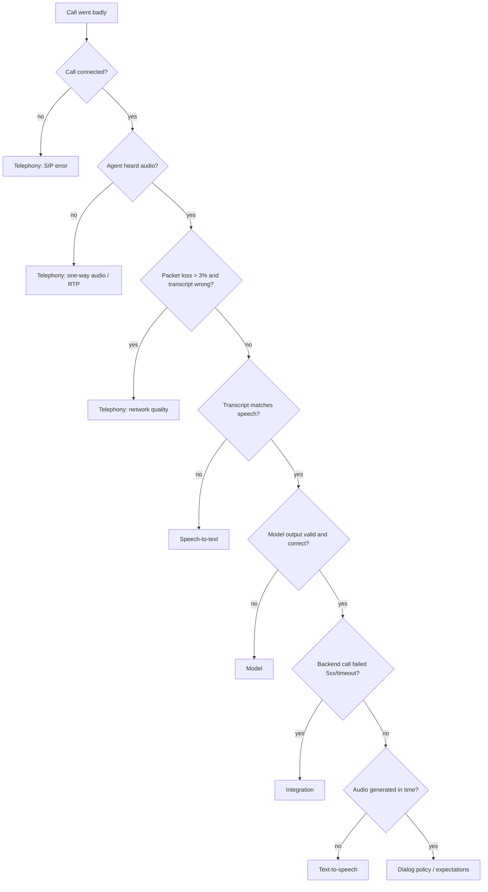

# Triage playbook: "the call went badly"

Goal: turn a vague complaint into a ticket an engineer can act on in minutes.

## 1. Collect the evidence

| Evidence | What it tells you |
| --- | --- |
| Recording or audio stats (codec, packet loss, jitter) | Whether the network delivered clean audio |
| Transcript: what the caller said vs. what STT heard | Whether speech recognition failed |
| Raw model output | Whether the model chose the right intent and slots, as valid JSON |
| Latency spans per layer | Where the silence came from |
| Logs (policy, integration) | Verification results and backend errors |

`python -m agent.replay --scenario <id> --seed <n> --triage` prints all of these for a call.

## 2. Work bottom-up

Why bottom-up: packet loss produces a bad transcript, which produces a wrong intent, which produces a wrong action. Every layer above the real fault looks broken. Blaming the first visible symptom (usually the model) sends the ticket to the wrong team.

## 3. Write the ticket

`python -m agent.replay --scenario F04 --seed 1 --ticket reports/ticket.md` generates:

- A title naming the layer and the symptom
- Severity and the owning team (from `owners.json`)
- A one-line reproduction command (the simulation is seeded, so it replays exactly)
- Evidence: metrics with thresholds, the said vs. heard transcript, and the raw model output
- The full transcript and latency trace

Examples: [packet-loss ticket](examples/ticket-F04-packet-loss.md), [model regression ticket](examples/ticket-F10-model-regression.md).

## Common pitfalls

- **4xx is not an outage.** A 409 "slot taken" is a correct business answer. Only 5xx and timeouts count as integration faults.
- **The TTS failure looks like the agent "ignoring" the caller.** Check whether the reply text was right before blaming the model.
- **One bad call isn't a trend.** Replay it with several seeds. If it fails on only one seed, record its pass rate (see [flake-policy.md](flake-policy.md)).
